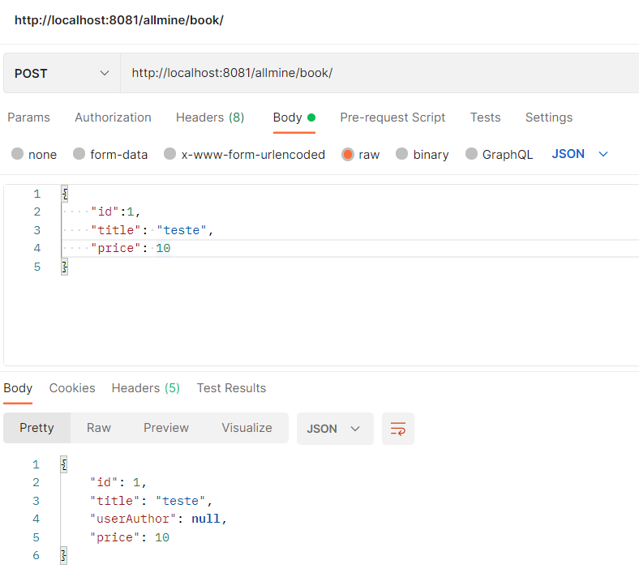

# AllMine
The objective this API is create/publish and buy books in digital format

### Stack
- Java 17
- Spring Boot
- Hexagonal architecture / Ports and Adapters
- H2 database

### Build application
    $ mvn clean install

### Run application
    $ You can run spring boot aplication with your IDE and test with postman requests http

### Path application
    $ http://localhost:8081/allmine

### Test evidence
